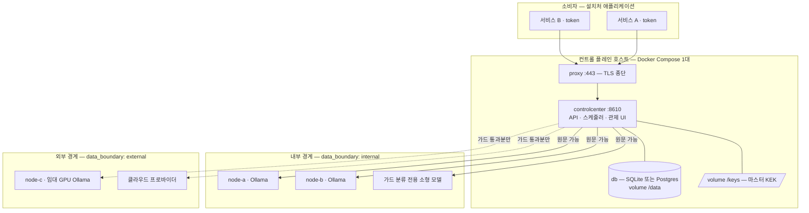
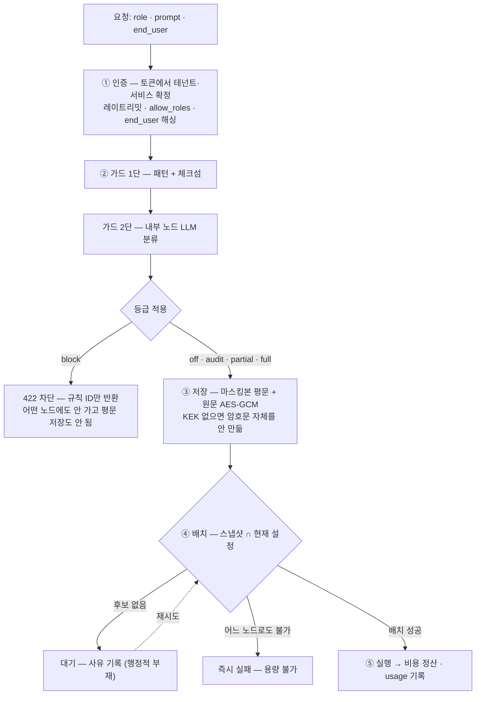
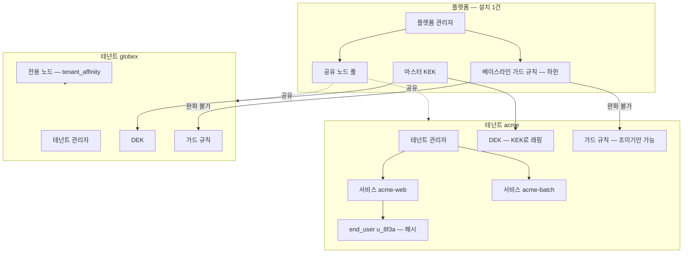
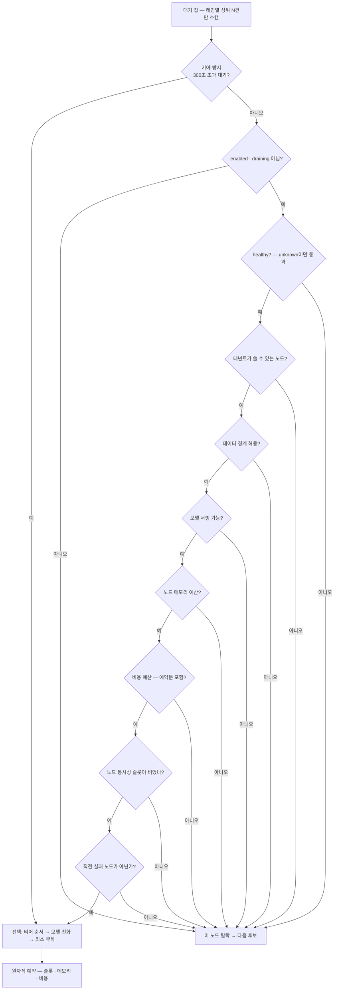
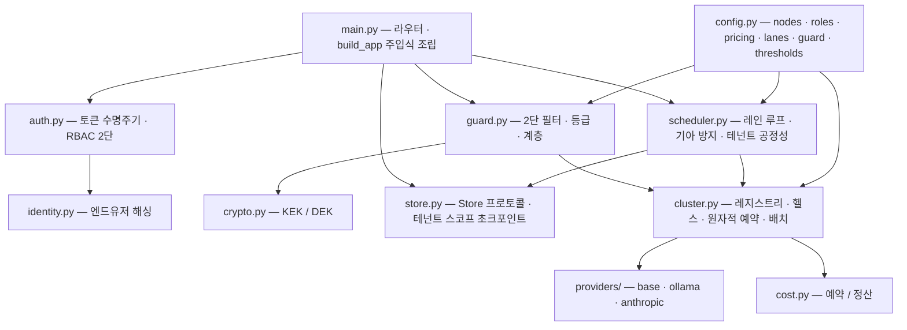

> ## 이 문서에 대하여
>
> **착수 시점의 계획서다.** 아래 본문은 구현을 시작하기 전에 쓴 그대로이며,
> 한 글자도 고치지 않았다 — 무엇을 하려고 했는지가 기록으로 남아야 하기 때문이다.
>
> 구현이 끝난 지금 이 문서는 **현재 코드의 설명서가 아니다.** 현재 동작은
> [`docs/architecture.md`](architecture.md) 와 코드가 권위이고, 이 문서는
> 그 설계에 이르기까지의 근거다.
>
> 구현 중 계획과 달라진 것을 아래에 모아 둔다. 계획서를 조용히 고쳐 놓으면
> **왜 달라졌는지가 사라지고**, 그게 이 프로젝트가 내내 경계한 실패 방식이다.
>
> ### 구현하면서 계획과 달라진 것
>
> | # | 계획 | 구현 | 왜 |
> |---|---|---|---|
> | 1 | 부트스트랩 시 베이스라인 규칙을 **`audit`** 등급으로 시작 (D3-④) | **`full`**(마스킹) 로 시작 | `audit` 는 통과시키되 마스킹을 안 한다 — 도입 첫 주 내내 주민번호가 마스킹 없이 노드로 나간다. 개인정보를 거르려고 산 제품이 도입 첫 주에 정확히 그것을 안 하는 셈이다. `full` 은 요청을 세우지 않으므로 "첫날 프로덕션이 서지 않는다" 는 목적은 그대로 달성하고, 탐지 기록도 동일해서 오탐률 측정과 승격 게이트가 그대로 작동한다 |
> | 2 | 모듈 구성 (G5) 에 `pipeline.py` 없음 | `pipeline.py` 를 추가하고 **잡을 만드는 유일한 경로**로 삼음 | 라우터가 `store.create_job()` 을 직접 부를 수 있으면 언젠가 누군가 가드를 건너뛴 경로를 만든다. 순서(인증 → 가드 → 저장 → 배치)를 규율이 아니라 구조로 만들려면 관문이 하나여야 한다 |
> | 3 | G5 에 `meta` · `notify` · `observability` · `bootstrap` · `cli` · `backup` 없음 | 6개 모듈 추가 | 계획서가 D7·D8·D3 에서 요구한 기능들인데 모듈 다이어그램에만 빠져 있었다 |
> | 4 | `/v1/session` 없음 | 추가 | 관제 UI 가 렌더 **전에** 역할과 문자열 카탈로그를 알아야 한다. 두 번에 나눠 받으면 첫 화면이 영어로 떴다가 한국어로 바뀌고, 역할을 모른 채 그리면 권한 없는 메뉴를 띄웠다 지우게 된다 |
> | 5 | `raw_prompt_retention_days` 는 테넌트 관리자 설정 (C4) | 테넌트는 **짧게만** 설정 가능 (플랫폼 상한에서 클램프) | 가드 규칙의 "테넌트는 조이기만 가능" 과 같은 방향이다. 조용히 자르지 않도록 설정 API 가 요청값·적용값·상한 셋을 함께 낸다 |
> | 6 | 파기 확인값을 요청 본문으로 | 본문 **또는 쿼리 파라미터** | DELETE 에 본문을 싣는 것을 프록시·CLI·클라이언트 라이브러리가 제대로 지원하지 않는다(테스트 클라이언트부터 거부했다). 파기 API 가 흔한 도구로 호출되지 않으면 설치처는 결국 DB 를 직접 지우고, 그 순간 확인도 감사도 사라진다 |
> | 7 | 설정의 모르는 키는 경고 (D5, 전진 호환) | **설정 파일은 경고, 노드 등록 API 는 거부** | 전진 호환은 신버전이 쓴 *파일*을 구버전이 읽는 이야기다. 등록 API 는 방금 사람이 친 값이라 `data_boundry` 오타를 흘려보내면 `external` 기본값이 조용히 적용되고 아무도 모르게 경계가 정해진다 |
> | 8 | Demo 프로파일용 별도 설정 (D2) | 설정 디렉터리 하나 | 시드 노드가 이미 목 프로바이더이고 실제 설치는 관제 UI 에서 노드를 등록해 덮어쓴다. 설정을 두 벌 유지하면 둘이 갈리고, 갈린 쪽이 하필 데모에서만 도는 경로가 된다 |
>
> ### 계획했으나 하지 않은 것
>
> | 항목 | 상태 |
> |---|---|
> | **부하 테스트** (검증 절) | **하지 않았다.** E6 의 처리량 수치(제출 250건/초 등)는 여전히 엔지니어링 추정이며, README 의 부채 목록에 그렇게 적어 두었다 |
> | Docker 빌드 실행 검증 | 개발 환경에 도커 데몬이 없어 `docker compose up` 을 실제로 돌려 보지 못했다. `preflight.sh` 가 그 사실을 정확히 리포트하는 것까지만 확인했다. 네이티브 경로(`python -m app --demo`)는 전 경로를 끝까지 돌렸다 |
> | 라이선싱·버전 정책 | 계획대로 범위 제외(프로토타입). 스키마 버전은 마이그레이션 안전장치로 남겼다 |
>
> ---

# LLM-ControlCenter — 설치형 LLM 클러스터 관제 솔루션

## Context

**이 프로젝트는 제품이다.** 다른 조직의 환경에 설치되어 그 조직의 LLM 백엔드들을 클러스터로 묶고,
누가 무엇을 쓰는지 관제하며, 나가는 프롬프트에서 개인정보·민감정보를 걸러내는 솔루션.
개발자의 로컬 환경(홈서버·맥 스튜디오·Tailscale)은 **설계 전제에서 제외한다** — 설치처의 환경은 모른다.

설계의 출발점은 `hosub-mcp`의 `llm-gateway`다. 그 시스템이 실제로 겪은 한계(§15)와 스스로 남긴
체크리스트(§17)가 이 제품이 해결할 문제 목록이다. 전체 정리는 `docs/reference/llm-platform-overview.md`
(커밋 `e925ee1`, 860줄, 원본 그대로)에 있고, 아래 모든 "§n"은 그 문서의 절 번호다.

> **레퍼런스 시스템은 단일 조직·단일 백엔드·수작업 토큰 발급을 전제로 만들어졌다.**
> 제품화는 그 세 전제를 전부 뒤집는 작업이다.

### 확정된 결정

| 축 | 결정 | 영향 |
|---|---|---|
| 백엔드 범위 | Ollama + 클라우드 동시 | 프로바이더 축 + 비용 축이 1급 |
| 컨트롤 플레인 | SQLite 단일 인스턴스 | `Store`는 프로토콜. 제품에선 Postgres가 상위 프로파일 |
| 기존 소비자 | 그린필드 | 레거시 `/v1` 호환 부담 없음 |
| 관제 UI | 포함 | 플랫폼/테넌트 2단 뷰 |
| 사용자 단위 | 서비스 + 엔드유저 | 아래 테넌트가 붙어 **3단**이 됨 |
| 필터 동작 | 마스킹 정도를 관리자가 선택 | 동작이 코드 상수가 아니라 설정값 |
| 민감 맥락 판정 | 패턴 + 로컬 LLM 2단 | |
| 원문 보관 | 암호화 + 보관 기간 관리자 설정 | 테넌트별 키로 확장 |
| **배포 형태** | **Docker Compose 번들** (D1) | Helm은 상위 프로파일에서 후속 |
| **네트워크** | **인터넷 전제 + 에어갭 옵션** | 오프라인 번들 제공 |
| **노드 편입** | **엔드포인트 등록형** | 노드에 아무것도 설치하지 않는다 |
| **테넌시** | **설치 1건 = 다중 테넌트** | 격리가 제품의 최대 리스크 |
| **언어** | **다국어 i18n 지원** | 문자열 카탈로그 + 로케일 협상. **가드 PII 규칙도 로케일별로 갈린다**(D11) |
| **프롬프트 버전** | **서버가 해시 자동 기록** | 요청 스키마 불변. 소비자 변경 없이 프롬프트 드리프트 감지 (C8) |
| **레이트리밋** | **테넌트 계층 추가 (3단)** | 예산과 같은 3단으로 대칭을 맞춘다 (A5) |
| **프로토타입 범위** | **15단계 전부** | 축소 없이 진행 |
| ~~라이선싱·버전 정책~~ | **이번 범위 제외** | 프로토타입 단계 |

### 제품화로 승격되는 부채

§15-3(토큰 발급·회전·폐기가 수작업)은 **더 이상 부채가 아니라 필수 범위**다.
소비자 추가가 "YAML 편집 + 재기동"인 제품은 성립하지 않는다. 다중 테넌트에서는 더욱,
테넌트 관리자가 플랫폼 관리자를 거치지 않고 자기 토큰을 발급·회전할 수 있어야 한다.

### 이미 완료된 것

- `e925ee1` 레퍼런스 문서 커밋·푸시 (`claude/mcp-enable-all-t0di60`)
- `docs/architecture.md` 초안 — **미커밋**. 제품/테넌시 관점으로 재작성 필요
- `.venv` + starlette 1.6.0 / httpx 0.28.1 / pyyaml 6.0.3 / uvicorn 0.52.4 / pytest
  — **`cryptography` 미설치**(C4에서 5번째 의존성으로 추가 예정). `.venv`·`docs/architecture.md`가
  현재 git 미추적 상태이며 1단계의 `.gitignore`·재작성으로 해소한다

---

## A. 테넌시 — 제품의 최대 리스크

### A1. 주체 3단

```
tenant: acme                         ← 격리 경계
  ├ service: acme-web    (token)     ← 권한·레이트리밋·예산
  │    └ end_user: u_8f3a91          ← 귀속·세부 예산 (불투명 ID)
  └ service: acme-batch  (token)
```

### A2. 격리 지점

| 축 | 격리 방법 |
|---|---|
| 데이터 | 모든 테이블에 `tenant_id`. **스토어 레이어 단일 초크포인트**에서 강제 |
| 암호키 | 테넌트별 DEK를 마스터 KEK로 래핑 — B의 암호문이 새도 A의 키로는 못 연다 |
| 예산 | 테넌트 → 서비스 → 엔드유저 3단 상한 |
| 가드 규칙 | **플랫폼 베이스라인(하한) + 테넌트 규칙(조이기만)** |
| 노드 | 기본 공유 풀. `tenant_affinity`로 전용 노드 지정 가능 |
| 감사 | 테넌트 감사 + 플랫폼 감사 2벌 (§6 "감사 2벌"의 확장) |

### A3. 테넌트 경계 누수가 최대 위험이다

한 번의 스코프 누락이 다른 조직의 프롬프트를 노출시킨다. 핸들러마다 `WHERE tenant_id = ?`를
손으로 뿌리면 **반드시 하나를 빠뜨린다.**

→ 스토어 API가 테넌트 컨텍스트를 **인자로 강제**하고, 스코프 없는 조회 경로를 아예 만들지 않는다.
플랫폼 관리자용 전역 조회는 별도 명시적 API(`*_across_tenants`)로만 두고 그 호출을 감사에 남긴다.

### A4. RBAC 2단

| 역할 | 권한 |
|---|---|
| 플랫폼 관리자 | 테넌트 생성·정지, 노드 등록, 전역 설정, **베이스라인 가드 규칙**, 전역 관제 |
| 테넌트 관리자 | 자기 서비스·토큰 발급/회전/폐기, 가드 규칙(조이기만), 예산, 엔드유저, 자기 관제 |

**테넌트 관리자는 베이스라인 가드 규칙을 완화할 수 없다.** 플랫폼이 정한 PII 차단을 테넌트가
끌 수 있으면 제품의 보증이 사라진다. 조이는 방향(더 많은 규칙, 더 강한 등급)만 허용한다.

### A5. 레이트리밋도 3단이다

예산이 테넌트 → 서비스 → 엔드유저 3단인데 레이트리밋만 2단이면 비대칭이다.
한 테넌트가 서비스를 여러 개 만들어 클러스터 입구를 독점할 수 있다.

```
테넌트 총량 상한
  └ 서비스별 상한
      └ 엔드유저별 상한
```

세 단계를 각각 슬라이딩 윈도로 검사하고, **429 응답에 어느 단계에서 걸렸는지 표시한다** —
안 그러면 소비자가 자기 한도를 늘려도 안 풀리는 이유를 알 수 없다.

B3의 테넌트 간 공정성(라운드로빈)과는 다른 장치다. 공정성은 **큐 안에서** 순서를 나누고,
레이트리밋은 **입구에서** 유입 자체를 막는다. 큐가 이미 한 테넌트로 가득 찬 뒤에는
공정성만으로 되돌릴 수 없으므로 둘 다 필요하다.

---

## B. 클러스터 축

### B0. 역할 = 정책, 프롬프트 = 호출자 소유

```yaml
# config/roles.yaml
summarize:
  model: qwen2.5:7b              # 기본 모델
  kind: generate                 # generate | embed
  lane: interactive
  timeout: 120                   # 1~3600
  options: {temperature: 0.2}
  max_prompt_chars: 200000
  placement: [internal]          # 티어 = 노드 태그 또는 노드 이름
  tier_models:                   # 티어별 모델 덮어쓰기 (선택)
    external: <cloud-model-id>
  system: "..."                  # 선택 — 요청의 system 이 없을 때만 쓰는 기본값
```

두 줄 계약(§4.1 계승):
- **역할 이름이 계약이고, 모델은 정책이다.** 소비자는 모델명을 하드코딩하지 않는다.
- **프롬프트는 호출자 소유다.** 요청의 `system`이 우선하고 없을 때만 역할 기본값을 쓴다.

클러스터가 되면서 "정책"의 범위가 넓어진다 — 역할 이름 뒤에서 바뀌는 것이 이제 모델뿐 아니라
**어느 기계에서 도는지, 돈이 드는지, 데이터가 어디까지 가는지**까지다.

**역할 오버라이드**(§8.5 계승): `roles.yaml`은 기본값, DB 오버라이드가 그 위에 얹힌다.
멀티테넌트에서는 테넌트별로 얹을 수 있다.
- 잘못된 오버라이드 행이 **기동을 막지 않는다** — 건너뛰고 상태 API로 알린다
- **드리프트가 보인다** — 오버라이드 수 > 0이면 실행 중 설정이 배포본과 다르다는 뜻
- **롤백 레버**: 오버라이드는 코드가 아니라 데이터다 (대가는 D10 — 백업 복원이 이것도 되돌린다)

### B1. 노드가 1급 도메인 — 등록형

노드 = "추론을 실행할 수 있는 한 곳". **관제 UI에서 URL·데이터 경계·용량을 입력하면 끝이고,
노드에는 아무것도 설치하지 않는다.** 순정 Ollama 엔드포인트를 그대로 쓴다.

등록 즉시 프로브해서 도달성·모델 인벤토리·버전을 수집하고, 실패하면 등록 화면에서 바로 알린다
(설치 후에 조용히 안 붙는 것이 제품에서 가장 나쁜 경험이다).

자동 발견(discovery)은 하지 않는다 — 노드가 조용히 늘면 비용과 데이터 경계가 조용히 는다.

### B2. 프로바이더 비대칭을 능력 플래그로 흡수

```python
class Capabilities:          # 프로바이더 속성 — 소프트웨어가 무엇을 요구하는가
    requires_model_install: bool
    uses_memory_budget: bool
    metered: bool
```

**데이터 경계는 여기 없다 — 노드 속성이다.** `provider: ollama`라고 로컬인 것이 아니다.
임대 GPU(vast.ai·RunPod)에 Ollama를 올리면 소프트웨어는 같지만 프롬프트는 남의 기계로 나간다.
경계를 프로바이더에 걸면 C2의 "분류기는 내부 노드 전용" 보장이 그 순간 무너진다.

노드마다 `data_boundary: internal | external`을 **선언으로 받고 추론하지 않는다.**
기본값은 `external`(fail-safe) — 안 적은 노드를 내부로 간주하면 실수가 새는 쪽으로 향한다.

### B3. 배치(placement) — (잡, 노드) 쌍 선택

**후보 필터** (하나라도 걸리면 탈락):
```
1. enabled 이고 draining 이 아닌가
2. healthy 인가                — unknown(아직 모름)이면 통과 (§7.2 _available is None 규칙)
3. 테넌트가 이 노드를 쓸 수 있는가  — tenant_affinity 확인
4. 데이터 경계가 허용되는가      — 잡의 허용 경계 ∩ 노드의 data_boundary
5. 이 모델을 서빙 가능한가
6. uses_memory_budget 이면 노드 잔여 메모리 예산에 들어가는가
7. metered 이면 테넌트·서비스 비용 예산이 예약분 포함해서 남았는가
8. 노드 동시성 슬롯이 비었는가
9. 이번 잡의 직전 실패 노드가 아닌가 (B7)
```

**선택**: `placement 티어 선언 순서` → `같은 티어 안에서 모델 친화` → `최소 부하`

티어가 모델 친화보다 위인 것이 중요하다. 뒤집으면 클라우드에 같은 모델이 웜으로 떠 있다는 이유로
로컬 우선 선언을 무시하고 과금 경로를 탄다. **성능 휴리스틱이 비용·데이터 경계 정책을 이길 수 없다.**

**기아 방지는 이 전부보다 위** (§13-7): 300초 이상 대기한 잡이 있으면 배치 가능한 첫 노드를 무조건 준다.
다중 테넌트에서는 여기에 **테넌트 간 공정성**이 추가된다 — 한 테넌트가 큐를 채워 다른 테넌트를
굶기지 못하도록 라운드로빈으로 후보를 뽑는다.

#### B3-1. 선택과 예약은 원자적이다

필터 통과 후 따로 배치하면 레인 루프가 병렬로 도는 순간 **같은 슬롯을 두 잡이 잡는다.**
메모리 예산도 같다 — 20GB 잔여를 두 잡이 각각 확인하고 각각 18GB를 올린다.

→ 슬롯·메모리·비용 예산을 **단일 락 아래서 "확인 후 즉시 차감"**. 실패한 잡은 다음 후보로.
예약은 잡 종료(성공·실패·취소) 시 반드시 해제한다.

#### B3-2. 스캔 창은 유한하다

틱마다 `대기 잡 × 노드` 전수 검사는 큐 1,000 × 노드 10 = 0.5초마다 10,000회다.
→ 레인당 상위 N건(기본 50)만 스캔하고 **잘린 사실을 상태 API에 노출**한다. 조용히 자르면
"전부 검토했다"로 읽힌다.

### B4. 스냅샷 시점 분리 — 안정성은 스냅샷, 안전은 교집합

| 필드 | 시점 | 근거 |
|---|---|---|
| `options` `timeout` `tier_models` | 생성 시점 스냅샷 고정 | 재현성 — 진행 중 잡이 오염되면 안 됨 |
| `placement` · 데이터 경계 | **스냅샷 ∩ 현재 설정** | 안전 — 좁히기만 하고 넓히지 않는다 |
| `node` `model` `tier` | 디스패치 시점 결정 | 노드 헬스가 런타임 상태라 불가피 |

스냅샷만으로는 안전 통제가 우회된다. 비용 사고로 관리자가 cloud 티어를 뺐는데 **큐에 있던 잡은
스냅샷에 `cloud`를 들고 그대로 나간다.** 스냅샷은 *재현성*에는 맞지만 *안전 통제*에는 반대로 동작한다.

### B5. 못 도는 잡 — 용량과 행정을 분리한다

| 상황 | 판정 | 동작 |
|---|---|---|
| 모든 노드가 바쁨 · pull 중 | 지금 못 돎 | 건너뛴다. 레인을 막지 않는다 |
| 어느 노드 **용량**으로도 못 담음 | 영원히 못 돎 | 사유 붙여 즉시 실패 |
| 노드 비활성·draining·전부 unhealthy | **행정적 부재** | 대기 + 별도 타임아웃(기본 15분) 후 실패 |
| 예산 초과 (metered) | 행정적 부재 | 로컬 티어 있으면 무료 경로로 강등, 없으면 대기 |

"티어 전부 비활성 → 즉시 실패"는 틀렸다. **관리자가 노드 한 대를 5분 정비하려고 내리면 그 티어
잡이 전부 하드 실패한다.** 대기 사유를 잡에 남겨 UI가 "노드 정비로 대기 12건"을 보여준다.

### B6. 비용 — 예약 후 정산

디스패치 시 `max_tokens` 기준 **상한 비용을 예약(reserve)**, 완료 시 실제 사용량으로 **정산(settle)**.
확인만 하면 동시 디스패치 N건이 각각 통과한 뒤 합계가 예산을 넘는다. 로컬은 단가 0으로 같은 경로.
실패 잡의 미보고 토큰은 과소 계상 — 알려진 오차로 문서에 남긴다.

### B7. 노드 장애·재시도·크래시 복구

**재시도는 재배치를 동반한다.** §7.3의 재시도는 노드를 바꾸지 않아 죽은 노드로 3회 재시도하고 끝난다
→ 직전 실패 노드를 후보에서 제외(B3 필터 9).

**크래시 복구가 이중 실행을 만든다.** §6의 "기동 시 `running` → `queued`"는 단일 백엔드에선 맞았다.
클러스터에선 컨트롤 플레인이 재시작하는 동안 **노드는 여전히 추론을 돌리고 있다.** 재큐되면 같은
작업이 두 번 돌고, metered면 **두 번 과금**된다. 노드에도 클라우드에도 취소 의미론이 없다.
→ metered 노드에 배정됐던 잡은 자동 재큐하지 않고 `needs_review`로 둔다.

**헬스**: 연속 실패 3회 → `unhealthy`. 회복은 연속 성공 2회(플래핑 방지). `unhealthy` 노드에는
30초마다 반열림 프로브 1건만.

**드레이닝**: 비활성화는 즉시 차단이 아니라 `draining` — 신규를 막고 실행 중인 잡은 완료시킨다.

### B8. 임베딩 동기 경로

§15-10의 부채가 클러스터에서 커진다. `kind: embed`는 큐 밖이지만 **어느 노드로 보낼지는 정해야 한다.**
→ 배치 로직을 스케줄러가 아니라 `cluster.py`에 두고 동기 경로도 **같은 필터·같은 예약**을 호출한다.
큐만 우회하고 배치·경계·비용·가드는 우회하지 않는다.

### B9. 단일 호밍 가시성

자동 복제는 하지 않는다(용량 판단은 사람 몫). 다만 모델이 노드 A에만 있고 A가 포화면 B·C가 놀아도
그 역할만 굶는다. **관제 센터가 안 보여주면 사람이 판단할 수 없다** → 단일 호밍 경고를 1급 카드로.

### B10. 모델 생애주기

설치처가 노드를 등록한 뒤 **모델을 어떻게 얹는가**가 온보딩의 절반이다. §8 전체를 계승하되
멀티노드·멀티테넌트로 확장한다.

```
역할이 미설치 모델을 참조
  → 배치 필터 5번에서 그 노드만 스킵 (레인을 막지 않는다 — §13-6)
  → model_requests 에 pending 생성 + 알림 (D8)
  → 승인                                   ← 플랫폼 관리자 권한
  → 컨트롤 플레인이 그 노드의 pull API 직접 호출 — progress 0~100
  → ready → 대기하던 잡이 자동 재개
```

**멀티노드 확장**: 요청 단위는 `(모델, 노드)` 쌍이다. 같은 모델을 3대에 얹으려면 요청 3건.
어느 노드에 얹을지는 사람이 정한다(B9 — 자동 복제 안 함).

**승인이 플랫폼 관리자 권한인 이유**: 승인은 그 노드 디스크에 수 GB를 내려받는 상태 변경이고,
노드는 **테넌트 공유 자원**이다. 테넌트 관리자가 남의 테넌트도 쓰는 노드의 디스크를 채울 수 없어야 한다.

거부·실패면 대기 잡은 **무한 대기 대신 명확한 오류**로 끝난다(§8.1 `DEAD_STATUSES` 계승).
거부한 모델은 다시 물어보지 않는다.

**크기 게이트**(§8.2 계승): 추정 크기가 대상 노드의 메모리 예산을 넘으면 **설치 전에** 거부한다.
안 그러면 20GB를 잘 받아 놓고 실행할 때마다 잡이 죽는다.

**삭제 차단 — `force`는 없다**(§8.3 계승). 다섯 중 하나라도 걸리면 거부:

| 차단 사유 | 왜 |
|---|---|
| 그 모델을 쓰는 역할이 있다 | 지워도 다음 요청에서 곧바로 재설치 대기 |
| 대기 중인 잡이 있다 | 그 잡들이 통째로 멈춘다 |
| 실행 중이다 | 진행 중인 추론이 깨진다 |
| 설치가 진행 중이다 | 부분 파일이 남는다 |
| 임베딩 역할이 쓴다 | 동기 경로라 소비자가 **즉시 503** 을 받는다 |

삭제 시 설치 요청 행 자체를 지운다 — `ready`로 두면 다음 탐지에서 되살아나고, `rejected`로 두면
이후 잡이 "설치가 거부됨"이라는 **거짓 사유**로 하드 실패한다.

**카탈로그**: 큐레이션 목록을 번들에 포함한다. **모델 레지스트리를 스크레이핑하지 않는다**
(§14 계승 — 검색 API가 없어 HTML 파싱에 기대야 하고, 남의 사이트 개편에 제품이 끌려 죽는다).
에어갭에서는 카탈로그가 오프라인 번들에 담긴 모델 목록이 된다.

---

## C. 거버넌스 축

### C1. 엔드유저 귀속

소비자가 요청에 `end_user`를 싣는다. **불투명 식별자여야 하며**, 관제 센터는 받은 값을 그대로
저장하지 않고 **테넌트별 솔트로 해시**한다 — 소비자가 실수로 이메일을 넣어도 DB에 이메일이 남지 않는다.
서비스는 `require_end_user: true`로 표기를 강제할 수 있다.

### C2. 프롬프트 필터 — 2단 판정

**순서가 계약이다: 필터 → 저장 → 배치.** 필터 전에 저장하면 원문이 무방비로 DB에 남고,
필터 전에 배치하면 이미 나간 뒤다.

```
1단  결정론적 패턴   PII 정규식 + 체크섬 검증 (µs, 비용 0, 감사 가능)
2단  로컬 LLM 분류   관리자가 문장으로 정의한 "맥락" — 패턴으로 안 잡히는 민감성
```

**2단은 내부 경계 노드 전용으로 강제한다.** "이거 민감해?"를 물으려고 원문을 외부로 보내면
필터가 스스로 유출 경로가 된다. 내부 노드가 없으면 분류를 건너뛰되 `on_classifier_error`를 적용한다.

체크섬 검증을 넣는 이유: 숫자 N자리를 전부 PII로 보면 오탐이 쏟아지고, **오탐이 쏟아지면 관리자가
규칙을 꺼버린다 — 안 켜진 필터는 없는 필터다.**

### C3. 마스킹 정도는 관리자가 정한다

| 등급 | 동작 |
|---|---|
| `off` | 규칙 비활성 |
| `audit` | 통과시키되 탐지 사실만 기록 — **규칙 승격 전 오탐률 측정용** |
| `partial` | 부분 마스킹 (`keep_tail`만큼 보존) |
| `full` | 전체 치환 |
| `block` | 요청 거부 (422 + 위반 규칙 ID, 원문은 응답에 안 실림) |

규칙마다 등급을 고르고, 티어별로 다르게 줄 수도 있다(`{internal: audit, external: block}`).

**`audit` 등급이 실전에서 가장 중요하다.** 새 규칙을 바로 `block`으로 켜면 오탐이 프로덕션을 세운다.
`audit`로 며칠 재고 오탐률을 본 뒤 승격시키는 것이 의도한 운영 흐름이다.

**계층**: 플랫폼 베이스라인(하한) → 테넌트 규칙(조이기만). 테넌트는 베이스라인을 완화할 수 없다(A4).

### C4. 원문 암호화 + 보관 기간

- **마스킹본**은 평문 저장 — 디버깅·프롬프트 개선의 재료.
- **원문**은 AES-256-GCM. 레코드마다 새 96비트 논스. **테넌트별 DEK**를 마스터 KEK로 래핑(A2).
- **KEK가 없으면 원문 보관을 아예 비활성화한다**(fail-closed) — 키 설정을 깜빡한 채 원문이 평문으로
  쌓이는 사고를 구조적으로 막는다.
- `raw_prompt_retention_days`는 테넌트 관리자 설정. 보존 루프가 **암호문만** 지우고 마스킹본은 남긴다.
- 복호화는 **테넌트 관리자 + 단건 조회**만, **열람이 감사에 남는다**(§9.3의 토큰 열람 패턴 계승).

`cryptography`를 5번째 의존성으로 추가한다. 레퍼런스가 "의존성 4개"를 이식성 근거로 삼았으므로(§3)
의식적 위반이며, 근거는 **암호를 직접 구현하는 쪽이 훨씬 나쁘다**는 것이다.

### C5. 거버넌스가 새 유출 경로가 되지 않게

| 위험 | 대응 |
|---|---|
| 분류하려고 원문을 외부로 보냄 | 분류 역할 내부 노드 전용 강제 (C2) |
| 감사 로그에 매칭된 값을 남김 | 감사에는 **규칙 ID·매칭 횟수·오프셋만** |
| UI가 원문을 화면에 뿌림 | UI는 마스킹본만. 원문은 단건 API + 감사 |
| 백업이 보관 기간을 무력화 | 백업에서 `prompt_cipher` 제외가 기본. KEK는 백업과 다른 곳에 |

마지막 항목이 §8.5("DB를 백업본으로 되돌리면 모델 선택도 조용히 되돌아간다")의 개인정보 판이다.
7일 뒤 암호문을 지워도 **30일 전 백업을 복원하면 지워졌어야 할 원문이 되살아난다.**

### C6. 삭제·내보내기

§17이 "외부 사용자가 들어오면 잡 격리·프롬프트 보관·**삭제 요구**가 새 요구사항이 된다"고 정확히
예고했다. 멀티테넌트 + 개인정보 필터 제품에서 이건 선택이 아니다.

| 요구 | 주체 | 범위 |
|---|---|---|
| 엔드유저 파기 | 테넌트 관리자 | 그 엔드유저의 잡·프롬프트·사용량 귀속 |
| 테넌트 파기 | 플랫폼 관리자 | 테넌트의 모든 데이터 + **DEK 폐기** |
| 내보내기 | 테넌트 관리자 | 잡·사용량·감사·설정 (마스킹본 기준) |

**DEK 폐기가 가장 강한 삭제다.** 테넌트 DEK를 파기하면 그 테넌트의 암호문은 **백업에 남아 있어도
복호화가 불가능하다** — C5의 백업 문제를 구조적으로 푸는 유일한 수단이다(crypto-shredding).
이것이 테넌트별 DEK를 둔 두 번째 이유다(첫 번째는 격리, A2).

파기는 되돌릴 수 없으므로 확인 절차 + 감사가 필수다. 감사에는 **언제 누가 무엇을 지웠는지**만
남기고 지워진 내용은 남기지 않는다(감사가 새 유출 경로가 되면 안 된다 — C5).

### C7. 가드 품질을 측정한다

§12.4의 원칙("LLM 출력을 믿지 말고 측정한다")이 이 제품에서 가장 중요해진다 —
**여기서는 LLM이 보안 판정을 하기 때문이다.** `audit` 등급만으로는 부족하다.

| 장치 | 무엇 |
|---|---|
| 정답셋(fixture) | 규칙별 양성/음성 샘플. 번들에 기본 세트, 테넌트가 자기 것 추가 |
| 회귀 평가 | 규칙·분류 모델 변경 시 정답셋으로 오탐/미탐률 산출 |
| 오탐 검토 큐 | `audit` 히트를 사람이 판정 → 정답셋으로 승격 |
| **규칙 승격 게이트** | 오탐률이 임계 이하일 때만 `audit` → `block` 승격을 허용 |

**§15-8 반영 — thinking 모델의 구조화 출력 문제**: 2단 분류는 enum 판정(구조화 출력)을 요구하는데,
hybrid thinking 계열은 structured output이 깨지는 미해결 이슈가 있다. 정확히 이 경로에 걸린다.

→ **분류 모델 후보는 등록 전에 정답셋으로 JSON/enum 준수율을 검증**하고, 임계 미달이면 등록을 거부한다.
thinking 계열은 thinking off(`/no_think` 등)를 강제한다.

**분류 실패는 판정이 아니다** — `on_classifier_error` 정책을 타되 그 사건을 **별도로 집계**한다.
실패율이 오르면 관리자가 알아야 한다(D8 알림).

### C8. 프롬프트 해시 — 서버가 자동 기록

§17의 "프롬프트 버전 관리"를 **요청 스키마를 건드리지 않고** 푼다. 소비자가 아무것도 안 해도
프롬프트가 바뀐 시점을 감지할 수 있다. 레퍼런스 §12.3의 `input_hash`가 같은 발상이다.

| 컬럼 | 대상 | 용도 |
|---|---|---|
| `system_hash` | 역할이 적용한 system 프롬프트 | **프롬프트 전략의 버전**. 이 값이 바뀐 전후로 품질·실패율을 비교한다 |
| `prompt_hash` | 사용자 프롬프트 | 중복 감지, 가드 2단 분류 캐시 키 |

**`prompt_hash`는 마스킹 후 + 테넌트 솔트로 만든다.** 원문 그대로 해싱하면 안 된다 —
주민번호·전화번호처럼 **탐색 공간이 좁은 값은 해시를 전수조사해서 복원할 수 있다.**
C1에서 엔드유저 식별자를 테넌트 솔트로 해싱한 것과 정확히 같은 이유다.
해시가 새 유출 경로가 되면 C5의 노력이 무의미해진다.

`system_hash`는 저엔트로피가 아니므로 솔트 없이 그대로 둔다 — 테넌트 간 비교(같은 역할을
쓰는지)에 쓸 수 있어야 하기 때문이다.

**품질 대조는 이 해시 위에서만 성립한다** — C7의 회귀 평가가 "어떤 프롬프트 버전에서 잰
오탐률인가"를 말할 수 있으려면 이 컬럼이 있어야 한다.

---

## D. 배포·패키징

### D1. 배포 형태 — Docker Compose 번들

에어갭 옵션이 요구사항이라 `docker save/load` 이미지 번들이 자연스럽고, 온프렘에 k8s 없는 곳이
많으며, 의존성(Python·cryptography·DB)이 이미지에 갇혀 **지원 비용이 가장 낮다.**
Helm 차트는 Scale 프로파일에서 후속으로 낸다 — 두 경로를 처음부터 유지하면 매니페스트·문서·테스트가
2벌이 되고 설정 체계 일치 부담이 계속 남는다.

### D2. 배포 프로파일 4종

| 프로파일 | 구성 | 대상 |
|---|---|---|
| **Demo** | 노트북 1대: 컨트롤 플레인 + SQLite + **목 프로바이더**(+ 선택적 소형 모델) | 영업 시연·PoC·개발자 온보딩 |
| **Starter** | 단일 호스트: 컨트롤 플레인 + SQLite + 내장 Ollama 1노드 | 소규모 실사용 |
| **Standard** | 컨트롤 플레인 호스트 + 외부 GPU 노드 2~3대, SQLite 또는 Postgres | 주력 |
| **Scale** | Postgres + 컨트롤 플레인 다중 인스턴스, Helm | 후속 |

#### Demo 프로파일 — LLM 없이 제품의 대부분을 보여준다

목 서버(D7)를 1급 데모 모드로 승격시킨다. 어차피 만들 산출물이라 추가 비용이 거의 없고,
**GPU 없는 노트북 한 대로 클러스터 제품을 시연할 수 있다는 것이 영업·PoC에서 큰 차이**를 만든다.

| 목 프로바이더로 시연 가능 | 방법 |
|---|---|
| 테넌시·격리 | 테넌트 2개를 만들고 서로 안 보이는 것을 확인 |
| **가드 1단(패턴)** | PII 샘플 투입 → 마스킹·차단 — **LLM 불필요** |
| **배치 라우팅** | 가짜 노드 여러 대 등록 → 티어 우선순위·데이터 경계 동작 |
| **장애 폴백** | 노드를 죽여 다른 노드로 넘어가는 것 — 클러스터 제품의 핵심 데모 |
| 비용 예약/정산 | 가짜 단가로 예산 소진 → 무료 경로 자동 강등 |
| 관제 UI 전체 · 알림 | 노드 그리드·큐·사용량·감사·웹훅 |

**목으로 안 되는 것**: 실제 생성 품질, 가드 2단 LLM 분류(설계상 `internal` 노드 전용).
2단 분류까지 보여주려면 소형 모델(1.5b급, ~1 GB) 하나를 로컬에 얹는다.

**도커 없는 실행 경로를 함께 제공한다** — 의존성이 5개뿐이라 현실적이다.
```bash
pip install -e . && python -m app.main --demo
```

##### 데모 호스트 권장 사양·OS

| 노트북 RAM | 데모 범위 |
|---|---|
| **4 GB** | 목 프로바이더 — 위 표 전부 |
| **8 GB** | + 소형 모델로 **가드 2단 분류 실연** (권장) |
| **16 GB** | + 3b~7b로 실제 생성까지 (CPU 추론이라 느림) |

**OS: Xubuntu 24.04 LTS 권장** (또는 Ubuntu Server + XFCE). 근거:
- **Windows·macOS 배제** — Docker Desktop이 VM으로 ~2 GB를 먼저 먹는다.
  컨트롤 플레인(512 MB)보다 도커가 4배 무겁다. Linux는 네이티브라 오버헤드가 거의 0.
- Ubuntu LTS는 Docker 공식 저장소와 Ollama 설치 스크립트가 1순위 지원 → 데모 준비 중 삽질이 최소.
- GNOME(~2 GB) 대신 XFCE(~600 MB) — 4 GB에서 데스크톱만으로 절반이 날아가는 것을 막는다.

RAM 예산(8 GB 기준): XFCE 0.6 + 브라우저 0.8 + 컨트롤 플레인 0.5 + Ollama 1.5b 1.5 = **3.4 GB**.

##### 데모 호스트 준비 체크리스트 (설치 문서에 포함)

| # | 항목 | 이유 |
|---|---|---|
| 1 | **절전·뚜껑 닫힘 억제** | §15-2("맥이 자면 백엔드가 사라진다")가 노트북 데모에서 그대로 재현된다. 시연 중 뚜껑을 닫으면 노드가 죽는다 |
| 2 | 부팅 시 자동 기동 | `restart: unless-stopped`. 현장에서 전원만 켜면 뜨게 |
| 3 | zram 스왑 | 4 GB에서 모델 로드 시 결정적 |
| 4 | mDNS(`*.local`) 접근 | 데모 현장 네트워크가 매번 바뀐다. IP를 외우지 않게 |
| 5 | **디스크 암호화(LUKS)** | 이 제품은 암호화된 프롬프트와 **마스터 KEK를 같은 디스크에** 들고 다닌다. 분실 시 둘 다 넘어간다 |

5번은 데모라서 넘어갈 항목이 아니다 — 제품 문서가 "KEK는 백업과 분리"(D6)를 요구하면서
데모 관행이 그 반대면, 설치처가 따라 하는 것은 관행 쪽이다.

```
┌──────────────────────────────────────────────────────────┐
│ 컨트롤 플레인 호스트  (설치처가 제공)                       │
│                                                           │
│  ┌───────────────────┐  ┌──────────┐  ┌───────────────┐  │
│  │ controlcenter     │  │ db       │  │ proxy (TLS)   │  │
│  │  :8610            │──│ SQLite   │  │  :443         │  │
│  │  API + 관제 UI    │  │ 또는 PG  │  └───────┬───────┘  │
│  └─────────┬─────────┘  └──────────┘          │          │
│            │  volumes: /data (DB) · /keys (KEK)│          │
└────────────┼────────────────────────────────────┼─────────┘
             │ 등록된 엔드포인트 (HTTP)            │
   ┌─────────┼──────────────┬────────────────┐   │ 소비자
   ▼         ▼              ▼                ▼   ▼
┌────────┐ ┌────────┐  ┌──────────┐  ┌─────────────────┐
│ node-a │ │ node-b │  │ node-c   │  │ 클라우드 프로바이더│
│ Ollama │ │ Ollama │  │ Ollama   │  │ 논리 노드         │
│internal│ │internal│  │ external │  │ external         │
└────────┘ └────────┘  └──────────┘  └─────────────────┘
   └────── 설치처 소유. 아무것도 설치하지 않는다 ──────┘
```

### D3. 설치 경험

```bash
tar xzf llm-controlcenter-<ver>.tgz && cd llm-controlcenter
./preflight.sh          # 포트·디스크·메모리·도커 버전 확인, 실패 사유를 사람 말로
docker compose up -d
```

최초 기동 시 **부트스트랩**:
1. 마스터 KEK 생성 → `/keys`에 저장, **1회만 표시**하고 백업 안내
2. 플랫폼 관리자 계정 생성 — **기본 자격증명 없음**, 랜덤 생성 후 1회 표시
3. 첫 테넌트 생성 + 첫 노드 등록(즉시 프로브)
4. 베이스라인 가드 규칙을 `audit` 등급으로 켜서 시작 — 처음부터 `block`이면 도입 첫날 막힌다

`doctor` 명령으로 언제든 진단: 노드 도달성·디스크 여유·키 존재·스키마 버전·설정 유효성.

### D4. 에어갭

오프라인 번들에 이미지 tar + 정적 자산(swagger-ui 등, 외부 CDN 금지 §14 계승) + 선택적 모델 가중치를
담는다. 에어갭 모드에서는 **클라우드 티어를 자동 비활성화**하고 UI에 그 사실을 표시한다
(설정에 남아 있는데 조용히 실패하는 것이 최악이다).

### D5. 업그레이드·마이그레이션

- 스키마는 **ADD COLUMN 전용**(§6 계승) — 추가·NULL 기본값만, 재작성·삭제 금지
- 설정 스키마에 버전을 박고 기동 시 호환성 검사. 모르는 키는 거부가 아니라 경고(전진 호환)
- 롤백은 이미지 태그 되돌리기. 스키마는 전진 호환이므로 구버전이 신버전 DB를 읽을 수 있다
- 업그레이드 전 자동 백업(단, `prompt_cipher` 제외 — C5)

### D6. 시크릿

| 항목 | 보관 |
|---|---|
| 마스터 KEK | 파일 마운트 또는 env. **백업과 분리** |
| 테넌트 DEK | KEK로 래핑해 DB에 |
| 서비스 토큰 | 해시만 저장. 발급 시 1회 표시(§9.3 확장) |
| 클라우드 API 키 | 테넌트별, KEK로 래핑 |

**토큰 수명주기 API**(발급·회전·만료·폐기 + 감사)가 1급 범위다 — §15-3의 승격.

### D7. 계약 자기 서빙 + SDK

§11 전체와 §13-10("개발 진입 장벽을 서비스가 치운다")을 계승한다. **제품에서는 더 중요하다** —
설치처 개발자가 붙이기 어려우면 우회로를 만들고, 레퍼런스가 그걸 "가장 비싼 실패"라고 적었다.

| 엔드포인트 | 내용 |
|---|---|
| `GET /v1/integration` | 사람이 읽는 통합 가이드 (마크다운) |
| `GET /v1/meta` | 기계가 읽는 계약 — 역할·한도·오류코드·엔드포인트·클라이언트 해시 |
| `GET /v1/openapi.json` · `.yaml` | OpenAPI 3.1, **토큰별 생성** |
| `GET /v1/client/*` | 단일 파일 클라이언트 + 목 서버 원본 |
| `GET /healthz` | 인증 불필요. 컨테이너 헬스체크·로드밸런서용 |
| `GET /metrics` | D8 |

**토큰마다 결과가 다르다**(§11.2 계승): `role` enum에 그 서비스가 쓸 수 있는 역할만 넣으므로
생성된 클라이언트가 못 쓰는 역할을 애초에 노출하지 않는다. **멀티테넌트에서 여기에 경계가 걸린다 —
다른 테넌트의 역할 이름이 OpenAPI에 새면 그것도 정보 유출이다.**

**정적 파일이 아니라 매번 생성한다** — 역할은 런타임에 바뀌고, 한도는 인스턴스에서 읽고,
허용 역할은 토큰마다 다르다. **엔드포인트 목록도 손으로 적지 않는다**: 라우트를 순회해 재고를 만들고
사람이 쓰는 것은 요약뿐이며, **라우트를 추가하고 요약을 안 달면 테스트가 실패한다.**
§13-8("손으로 관리하는 표는 반드시 어긋난다 — 실제로 어긋났다")의 장치다.
원칙만 인용하고 장치를 안 만들면 같은 실수를 반복한다.

**목 서버를 번들에 포함한다.** 설치처 개발자가 **노드도 토큰도 없이** 통합 코드를 완성할 수 있어야 한다.
목 서버는 역할 목록을 실제 설정에서 읽으므로 역할 이름이 어긋나지 않는다.

**오류 처리 계약**(§5.4 계승): 분기는 **HTTP 상태와 `retryable`** 로 한다. `error` 문자열로 분기하지
않게 계약에 명시한다. `/v1/meta`의 `error_codes`가 전체 목록이되 **enum으로 쓰지 않는다**
(엄격한 검증기가 진짜 응답을 거부하기 때문).

### D8. 운영 인터페이스

| 항목 | 내용 |
|---|---|
| **알림** | **상태 전이에서만**(§10.2 계승). 노드 오프라인·복구, 모델 설치 승인 대기, 예산 소진(80%·100%), 가드 차단 급증, 분류 실패율 상승 |
| 알림 채널 | 웹훅(Slack/Teams 호환) + SMTP. **실패가 파이프라인을 죽이지 않는다**(예외를 삼키고 로그만) |
| **메트릭** | Prometheus/OpenMetrics `GET /metrics` — 설치처의 기존 모니터링에 물린다 |
| **로그** | 구조화(JSON) stdout. **프롬프트·응답 본문·비밀 미포함** |
| **진단 번들** | `./doctor.sh --bundle` — 설정(비밀 마스킹)·스키마 버전·노드 상태·최근 오류를 tar로. 지원 요청용 |

알림 3원칙 계승: 상태 전이에서만 / 기동 시 "복구됨"을 보내지 않는다(재시작마다 시끄러워진다) /
비밀·프롬프트·응답 본문을 담지 않는다.

관제 센터가 알림 없이는 관제를 못 한다 — "사람이 모르면 조용히 멈추는 지점"이 정확히 알림의 기준이다.

### D9. 노드 구간 보안

Ollama는 기본 무인증이다. 컨트롤 플레인 ↔ 노드 구간을 어떻게 보호할지 **명시한다**.

- 기본 전제: **노드는 신뢰 네트워크에 있다**(사설망·VPN). 문서에 명시하고 `preflight`가 경고한다.
- 옵션: 노드별 `auth_header`(노드 앞 리버스 프록시가 검사) + TLS. `nodes.yaml`에 선언.
- **`data_boundary: external` 노드는 TLS·인증을 필수로 강제한다** — 공개망을 지난다는 뜻이므로.

전제를 안 적으면 설치처가 노드를 공개망에 열어두고 "제품이 알아서 지켜주겠지"로 넘어간다.

### D10. 백업·복원·DR

D5가 백업만 다뤘다. **복원 절차가 없으면 백업은 없는 것과 같다.**

| 절차 | 내용 |
|---|---|
| 백업 | 자동. `prompt_cipher` 제외(C5). DB + 설정. **KEK는 별도 위치** |
| 복원 | `./restore.sh <backup>` — 스키마 버전 호환 검사 후 복원. **복원이 역할 오버라이드를 되돌린다는 경고를 띄운다**(§8.5 · B0) |
| DR | **KEK 분실 = 암호문 영구 손실.** 부트스트랩에서 KEK 백업을 강제 안내 |
| 검증 | 백업 무결성 정기 확인 + 복원 리허설 절차를 문서에 |

### D11. 다국어(i18n)

문자열 카탈로그(로케일별 JSON) + 로케일 협상(`Accept-Language` → 사용자 설정 → 테넌트 기본값 →
플랫폼 기본값). 멀티테넌트이므로 **테넌트마다 기본 로케일이 다를 수 있다.**

번역 대상: 관제 UI · 사람이 읽는 오류 메시지 · 알림 본문 · 설치/운영 문서.

#### 기계용 코드는 절대 번역하지 않는다

§5.4가 "`error` 문자열로 분기하지 말 것"을 계약으로 못박았다. 다국어를 넣으면 이 계약이
**깨지기 쉬워진다** — 소비자가 한국어 메시지로 분기하던 코드가 영어 환경에서 조용히 실패한다.

| 층 | 번역 | 예 |
|---|---|---|
| HTTP 상태 · `retryable` · 오류 코드 · 규칙 ID | **안 함** | `429`, `budget_exceeded`, `kr_rrn` |
| 사람이 읽는 메시지 | 함 | "예산을 초과했습니다" |

응답에 **둘 다** 싣는다. 분기는 코드로, 표시는 메시지로.

#### 가드 PII 규칙이 로케일별로 갈린다 — i18n의 진짜 영향

이것이 단순 번역 문제가 아닌 이유다. **개인정보의 형태 자체가 나라마다 다르다.**

| 로케일 | 대표 식별자 | 검증 방식 |
|---|---|---|
| 한국 | 주민등록번호 · 사업자등록번호 · 휴대폰 | 체크섬 상이 |
| 미국 | SSN · EIN | 자릿수·범위 규칙 |
| 일본 | マイナンバー | 체크디지트 |
| 공통 | 카드번호 · IBAN · 이메일 · IP | Luhn · mod-97 |

→ 베이스라인 가드 규칙을 **로케일 팩으로 묶어 제공**하고, 테넌트가 자기 로케일 팩을 켠다.
공통 팩(카드·이메일 등)은 항상 켜진다.

**로케일 팩을 안 켜면 그 나라 PII는 안 잡힌다.** 부트스트랩에서 테넌트 로케일을 물어보고
해당 팩을 자동으로 켜되, 관제 UI에 "현재 켜진 로케일 팩"을 상시 표시한다 —
안 켜진 필터는 없는 필터인데, 다국어에서는 **켰다고 착각하기가 더 쉽다.**

---

## E. 규모 산정

### E1. 레퍼런스 워크로드 프로파일

산정의 기준선은 실제로 돌던 시스템의 실측값이다. 출처: 레퍼런스 게이트웨이 `usage` 테이블
(§6에 따라 **30일 보존**이므로 30일 치 실부하), 조회 시점 2026-08.

| 지표 | 값 |
|---|---|
| 호출 | 106,368 건 / 30일 = **3,546 건/일** |
| 평균 지연 | **3,284 ms/호출** |
| 평균 출력 토큰 | 210 토큰/호출 |
| 누적 GPU 점유 | 97.0 시간 → **가동률 13.5%** (직렬 슬롯 1개 기준) |
| 성공률 | 89.2% (실패 10.8%도 GPU를 먹는다) |

이 프로파일은 **뉴스·공시 분류 워크로드**(짧은 출력, 중간 입력, 버스트성)의 특성이다.
설치처의 워크로드가 다르면 E2 공식에 자기 값을 넣는다.

### E2. 산정 공식

```
필요 슬롯 = (피크 호출률 [건/분] × 평균 지연 [초]) ÷ (60 × 목표 점유율)

목표 점유율 0.7 권장 — 버스트·재시도 여유
```

레퍼런스 프로파일 대입(일 물량의 70%가 10시간에, 버스트는 그 평균의 3~5배):

```
활성 평균 = 3,546 × 0.7 ÷ 10 ÷ 60 = 4.1 건/분
버스트    = 12~20 건/분
필요 슬롯 = 15 × 3.28 ÷ (60 × 0.7) = 1.17 → 2 슬롯
```

**평균만 보면 1대로 충분(13.5%)하지만 버스트가 단일 슬롯의 80%를 먹는다.** 여기에 실패율 10.8%의
재시도가 겹치면 큐가 쌓인다 — 레인 동시성 > 1이 필요하고, 그게 메모리 헤드룸을 요구한다.

### E3. 가드 2단이 추가하는 부하

| 추가분 | 산정 | 영향 |
|---|---|---|
| **가드 2단 LLM 분류** | 필터 대상 요청당 +1회, 소형 모델 ~0.5초 | 호출 수 **최대 2배**, GPU 시간 **+15%** |
| 1단 패턴 · 해싱 · 암호화 · 헬스 폴링 | µs~ms 단위 | 무시 가능 |

호출 수는 2배지만 GPU 시간은 +15%뿐이다 — 분류 모델이 훨씬 작기 때문. 프롬프트 해시 캐시가 먹히면 더 낮다.

> **가드는 전용 레인을 가져야 한다.** 분류 잡이 대형 batch 잡 뒤에 줄 서면 필터 한 번에 수 분이 걸린다.
> **보안 경로가 head-of-line blocking에 걸리는 것은 설계 실패다.**

### E4. 서버 대수 — LLM 노드 제외

**컨트롤 플레인은 1대다** (Starter·Standard). 그 1대에 컨테이너 3개(`proxy` · `controlcenter` · `db`)가 돈다.

별도 서버가 생기지 않는 이유:

| 흔히 필요한 것 | 이 설계 | 근거 |
|---|---|---|
| 노드 에이전트 서버 | 없음 | 엔드포인트 등록형 — 노드에 아무것도 설치 안 함 (B1) |
| 별도 웹서버 | 없음 | 관제 UI를 `controlcenter`가 직접 서빙 |
| 메시지 브로커 | 없음 | 잡 큐가 DB 테이블 (§7 계승) |
| 캐시 서버 | 없음 | 헬스·모델 인벤토리는 프로세스 메모리 |
| 워커 서버 | 없음 | 추론은 전부 LLM 노드. 가드 2단 분류도 노드에서 돈다 |

| 프로파일 | 컨트롤 플레인 서버 |
|---|---:|
| Demo | **1대** (노트북 · LLM 노드도 목으로 대체하면 총 1대) |
| Starter | **1대** |
| Standard | **1대** |
| Scale (후속) | 3~4대 — `controlcenter` ×2 + Postgres ×1(+standby) |

**서버는 아니지만 별도 위치가 필요한 것**: ① 백업 저장소(NAS·오브젝트 스토리지면 충분) ②
마스터 KEK. 둘을 컨트롤 플레인 호스트에 함께 두면 1대 구성의 단순함이 그대로 단일 실패점이 되고,
백업 유출 시 암호문도 함께 열린다(C5·D6).

### E5. 프로파일별 권장 사양

컨트롤 플레인은 추론하지 않는다 — asyncio I/O와 DB뿐이라 가볍다.

| | **Demo** | Starter | Standard | Scale |
|---|---|---|---|---|
| 컨트롤 플레인 vCPU / RAM | **1 / 512 MB** | 2 / 4 GB | 4 / 8 GB | 4×N / 8 GB |
| DB | SQLite | SQLite | SQLite 또는 PG | Postgres |
| 디스크 | **2 GB** | 50 GB | 100~200 GB | 별도 볼륨 |
| LLM 노드 | 목 (+선택 1.5b) | 내장 1 (16~24 GB) | 2~3 (24~48 GB) | 4+ , 모델 2중 호밍 |
| 레인 동시성 | int 1 / batch 1 / guard 1 | int 2 / batch 1 / guard 2 | int 3 / batch 2 / guard 4 | 설정값 |

**컨트롤 플레인 절대 최소치는 1 코어 / 512 MB / 2 GB 디스크다.** 추론을 하지 않으므로
파이썬 런타임 ~80 MB + 대형 프롬프트 처리 시 건당 2~3 MB가 전부다(200 KB 한글 프롬프트가
마스킹본·암호문까지 합쳐 ~2.5 MB). 라즈베리파이급에서도 돈다.

**노드 메모리 산정**: 동시에 상주할 모델 크기의 합 + 20% 여유.
예) 대형 20GB + 중형 9GB + 가드 1.2GB = 30.2GB → 예산 40GB 노드 1대 또는 분산 2대.

### E6. 사용자 증가를 감당하는가 — 컨트롤 플레인 부하 분석

**결론: 컨트롤 플레인은 병목이 아니다.** 추론을 하지 않으므로 요청당 CPU가 작고,
클러스터가 훨씬 먼저 막힌다. 늘려야 하는 것은 LLM 노드와 DB이지 이 서버가 아니다.

#### 요청당 CPU 추정 (제출 경로, 프롬프트 4KB)

| 단계 | 추정 |
|---|---:|
| HTTP 파싱·라우팅 | 0.1 ms |
| 인증 (해시 조회 + HMAC) | 0.05 ms |
| **가드 1단 정규식** (4KB × 20패턴) | **1.5 ms** |
| AES-256-GCM 4KB (AES-NI) | 0.003 ms |
| DB insert (WAL) | 0.3 ms |
| **합계** | **≈ 2 ms** |

→ 코어 1개 기준 **제출 ~250건/초**, **조회(폴링) ~2,000건/초**.
노드 3대 × 슬롯 3개 클러스터는 **2.7 job/초**가 상한이므로 약 **90배 여유**다.
컨트롤 플레인 1코어를 포화시키려면 동시 슬롯 825개 ≈ GPU 노드 275대가 필요하다.

> 위 수치는 엔지니어링 추정이다. **부하 테스트로 검증하기 전까지 사실로 취급하지 않는다**(검증 절).

#### 클러스터와 무관하게 사용자 수를 따라 늘어나는 것

**(a) 폴링 — 유일하게 파국으로 가는 경로**

```
클러스터 포화 → 큐 증가 → 대기 잡 증가 → 폴링 증가 → 컨트롤 플레인 과부하
                  ↑                                        │
                  └────────────── 응답 지연 ←──────────────┘
```

대기 잡 10,000건이 2초마다 폴링하면 5,000 req/초로 1코어 한계를 넘는다.
**컨트롤 플레인이 자기 부하가 아니라 클러스터 포화의 *증상*으로 죽는다.**
통합 `wait` 파라미터(§4.2 계승)가 완화책이지만 **강제 장치가 없으면** 소비자가
`wait=0` + 1초 폴링을 하는 순간 그대로 당한다 → E7의 수정 2.

**(b) 큰 프롬프트 × 가드 정규식 — 이벤트 루프 블로킹**

| 프롬프트 | 가드 1단 | 코어당 처리량 |
|---|---:|---:|
| 4 KB | 1.5 ms | 250/초 |
| 40 KB | 15 ms | 60/초 |
| **200 KB** (§5.3 상한) | **40~80 ms** | **12~25/초** |

동기로 이벤트 루프 위에서 돌면 그동안 **다른 모든 요청이 멈춘다** → E7의 수정 1.

**(c) 스토리지·집계** — 사용량 테이블이 1,000만 행을 넘으면 대시보드 집계가 느려진다.
롤업 테이블 도입 시점이다.

#### 규모별 판정 — 엔드유저 30,000명 시나리오

테넌트 100 × 서비스 3 × 엔드유저 100, 1인당 10건/일 = **30만 건/일**:

| 항목 | 필요량 | 판정 |
|---|---|---|
| 컨트롤 플레인 | 평균 3.5/초, 피크 20/초 | **1대로 충분** |
| **LLM 노드** | 20/초 × 3.3초 = 동시 66슬롯 | **약 22대** ← 비용의 실체 |
| 스토리지 | 3 GB/일 = 90 GB/월 | **Postgres 전환** (E9 트리거) |
| 폴링 | 대기 잡에 비례 | `wait` 강제 없으면 위험 |

### E7. 위 분석에서 나온 설계 수정

1. **가드 1단을 스레드 풀로 오프로드.** 프롬프트가 임계(기본 16KB)를 넘으면 이벤트 루프 밖에서
   실행한다. 안 하면 큰 프롬프트 한 건이 전체 응답을 세운다.

   > **실측 결과 이 근거는 틀렸다.** 오프로드해도 루프는 그대로 선다(200KB 2건에
   > 95.8ms 대 95.3ms) — `re` 가 GIL 을 놓지 않기 때문이다. 장치는 남기되 방어로
   > 세지 않는다. 실효 방어는 `max_prompt_chars`. capacity.md §6.2-b 를 보라.

2. **폴링 방어.** 상태 조회에 별도(더 넉넉한) 레이트리밋을 두고, 응답에 큐 위치 기반
   **적응형 `retry_after`** 를 실어 보낸다. 계약 문서에 `wait` 사용을 권고로 명시한다.
   완료 콜백은 §14대로 여전히 안 만든다(아웃바운드는 인증·SSRF 문제를 만든다).

3. **API 워커 다중화 경로를 미리 열어둔다.** uvicorn 워커 N개 + **스케줄러는 싱글턴 별도 프로세스**로
   분리한다. 스케줄러가 워커마다 돌면 **잡이 중복 배치된다** — 성능이 필요해서 워커를 늘리는
   순간 조용히 깨지는 구조를 처음부터 만들지 않는다. SQLite WAL은 다중 리더 + 단일 라이터를
   지원하므로 이 분리는 SQLite 프로파일에서도 성립한다.

### E8. 스토리지 산정

행당 ~10 KB (마스킹본 4 + 암호문 4 + 응답 1 + 메타·인덱스 1) 기준:

```
일 증가        = 호출/일 × 10 KB          (레퍼런스: 35 MB/일)
잡 보존 30일    = 일 증가 × 30             (1.05 GB)
암호문 7일      = 호출/일 × 4 KB × 7       (100 MB)
usage·감사·필터 = 잡의 30%                 (0.3 GB)
WAL·인덱스 여유 = 소계 × 2
────────────────────────────────────────
레퍼런스 정상 상태 ≈ 1.5 GB → 10배 성장 여유 포함 30 GB
```

→ Starter 50 GB, Standard 100~200 GB. **SQLite는 이 규모에서 병목이 아니다**(E9 전환 트리거 참조).

### E9. 증설·전환 트리거

임계값은 **`config/thresholds.yaml` 한 곳에서 읽고 문서는 그 파일을 인용한다** —
문서의 숫자와 코드의 임계값이 갈라지면 §13-8("손으로 관리하는 표는 반드시 어긋난다")을 그대로 반복한다.

| 지표 | 임계 | 조치 |
|---|---|---|
| 레인 슬롯 점유율 (5분 평균) | > 70% | 노드 증설 |
| 큐 대기 p95 | > 30초 | 레인 동시성 상향 → 안 되면 노드 증설 |
| 기아 방지 발동 | > 10회/일 | 배치 경합 — 노드 증설 |
| 노드 메모리 예산 거부율 | > 5% | 해당 노드 메모리 증설 |
| 단일 호밍 역할의 노드 점유율 | > 60% | 그 모델을 2번째 노드에 복제 (B9) |
| 스캔 창 절단 (B3-2) | 상시 | 스캔 상한 상향 또는 노드 증설 |
| 클라우드 비용 소진율 | 월 예산의 > 80% | 배치 정책 점검 |
| **DB 크기** | **> 50 GB** | **SQLite → Postgres 전환 (Scale 프로파일)** |
| **테넌트 수** | **> 20** | **Scale 프로파일 검토** |

---

## F. 관제 UI

### F1. 플랫폼 관리자 뷰
테넌트 목록·상태·소비량 순위, 노드 그리드(헬스·부하·모델·`data_boundary` 배지·테넌트 전용 여부),
전역 비용, 베이스라인 가드 규칙, 라이선스/버전·업그레이드 알림.

### F2. 테넌트 관리자 뷰
- **연결 정보** — 서비스별 연결 상태·마지막 요청·레이트리밋 잔여·활성 엔드유저 수·토큰 발급/회전
- **사용 정보** — `서비스 × 엔드유저 × 역할 × 노드` 축의 호출·토큰·비용·지연·성공률, 예산 소진율
- **가드 현황** — 규칙별 히트, `audit` 규칙의 **오탐 검토 큐**, 오탐률과 **승격 게이트 상태**(C7),
  분류 실패율 추이
- **잡 조회** — 마스킹본만. 원문은 단건 복호화 + 감사
- **데이터 관리** — 엔드유저 파기 · 내보내기 · 보관 기간 설정 (C6)

### F3. 모델 관리 뷰 (플랫폼 관리자)
설치 요청 승인 대기 카드, 노드별 모델 배치 현황(어느 모델이 몇 대에 있는지), 설치 진행률,
삭제 시 **차단 사유 표시**, 카탈로그 검색 (B10).

### F4. 공통
클러스터 1급 카드 2개: **단일 호밍 경고**(B9) · **대기 사유별 잡 수**(B5).
외부 CDN 금지(§14 계승) — 의존성 없는 바닐라 JS.

---

## G. 다이어그램

### G1. 서버 구조도 (Standard 프로파일)



**읽는 법**: 실선은 원문이 갈 수 있는 경로, 점선은 가드를 통과한 것만 가는 경로.
`node-c`가 Ollama인데도 점선인 것이 B2의 요지다 — **소프트웨어가 아니라 기계의 위치가 경계를 정한다.**
노드에는 아무것도 설치하지 않으므로 상자 안에 에이전트가 없다.

### G2. 요청 처리 흐름 — 순서가 계약이다



②가 ③보다, ③이 ④보다 먼저인 것이 계약이다. ②를 ③ 뒤로 옮기면 원문이 무방비로 DB에 남고,
②를 ④ 뒤로 옮기면 이미 나간 뒤다.

### G3. 테넌시 계층과 격리 경계



`BASE → R1/R2`의 "완화 불가"가 A4의 핵심이다. 테넌트가 플랫폼의 PII 차단을 끌 수 있으면
제품의 보증이 사라진다.

### G4. 배치 결정 — 필터와 선택



**티어가 모델 친화보다 위**인 것이 데이터 경계와 비용을 지키는 장치다.
뒤집으면 외부에 같은 모델이 웜으로 떠 있다는 이유로 내부 우선 선언을 무시하고 과금 경로를 탄다.

### G5. 모듈 구성



`guard.py → cluster.py` 화살표가 B8·C2의 이유다 — 가드 2단 분류도 배치를 거쳐 내부 노드에서 돈다.
동기 임베딩 경로도 같은 `cluster.py`를 호출해서 배치·경계·비용을 우회하지 못하게 한다.

---

## 구현 단계

브랜치: `claude/mcp-enable-all-t0di60`. 각 단계 끝에서 테스트를 돌리고 커밋한다.

### 완료 (1~7단계 · 커밋 8건 · 테스트 274개 · 앱 코드 4,800줄)

| # | 내용 | 커밋 | 비고 |
|---|---|---|---|
| 1 | 문서 + 골격 + 설정 + i18n 골격 | `4402cf7` | 설정 7종 · 문서 4종 · 로케일 2종 |
| 2 | 스토어 + 테넌시 초크포인트 | `f7ae4a2` | `TenantScope` 강제 · 크래시 복구 · 보존 |
| 3 | 인증 · RBAC 2단 · 3단 레이트리밋 | `a968dc7` | 토큰 수명주기 · 신원 해싱 |
| 4 | 프로바이더 (base·ollama·anthropic·mock) | `934a3ca` | 능력 플래그 · `retryable` 판정 |
| 5 | 클러스터 배치 + 비용 예약/정산 | `d2b9850` | 9단 필터 · 원자적 예약 · 헬스 |
| 6 | 모델 생애주기 | `33dcfbc` | 크기 게이트 · 삭제 차단 5종 |
| 7 | 거버넌스 (crypto + guard) | `9f71689` | 2단 필터 · 경계 축소 · KEK/DEK |

7단계에서 **`system` 프롬프트가 필터를 통째로 우회하던 결함**을 발견해 수정했다(회귀 테스트 포함).

### 남은 작업 (8~15단계)

#### 8. 가드 품질 측정 — `app/evals.py`

체크섬은 1자리라 무작위 값의 약 90%만 걸러낸다(7단계에서 테스트로 확인). **여기서는 LLM 이
보안 판정을 하므로** 품질을 감이 아니라 정답셋으로 재야 한다.

- 스토어에 `eval_fixtures`(규칙별 양성/음성 샘플) · `eval_runs`(회귀 평가 결과) 추가
- 회귀 평가: 규칙·분류 모델 변경 시 오탐률·미탐률 산출
- 오탐 검토 큐: `filter_events.reviewed/verdict`(이미 있음)를 사람이 판정 → 정답셋으로 승격
- **승격 게이트**: 오탐률이 `promotion_max_false_positive_rate` 이하일 때만 `audit` → `block`
- **분류 모델 등록 게이트**: 구조화 출력 준수율이 `classifier_min_schema_compliance` 미만이면
  등록 거부 (hybrid thinking 계열이 structured output 을 깨뜨리는 이슈가 여기 걸린다)

#### 9. 스케줄러 — `app/scheduler.py`

배치는 `cluster.place()` 가 이미 한다. 스케줄러는 **무엇을 언제 어떤 순서로** 넘길지만 정한다.

- 레인 루프: 설정 가능한 동시성(`guard` 레인 포함). 레인당 코루틴 하나
- **기아 방지가 티어·친화·부하보다 위** — `starvation_seconds` 초과 잡을 맨 앞으로
- **테넌트 공정성**: 라운드로빈으로 후보를 뽑아 한 테넌트가 큐를 채워도 다른 테넌트가 안 굶게
- 스캔 창 상한(`scan_window_per_lane`) + **절단 사실을 상태 API 에 노출**
- 재시도: 백오프 2→4→8초 + `last_failed_node` 제외(cluster 가 이미 지원)
- 행정적 부재 대기 타임아웃(`administrative_wait_timeout_seconds`)
- 배경 루프: 헬스 프로브 · 모델 설치(`process_approved`) · 보존 정리 · 레이트 카운터 정리
- **싱글턴 분리**: 스케줄러는 별도 프로세스로 뜰 수 있어야 한다. 워커마다 돌면 잡이 중복 배치된다

#### 10. API + 계약 자기 서빙 — `app/main.py` · `app/meta.py`

- `build_app(config=, store=, cluster=, guard=, scheduler=, ...)` 전부 주입식
- 소비자: `POST /v1/generate`(통합 `wait`) · `POST /v1/embed`(동기, **같은 배치 필터**) ·
  `GET/DELETE /v1/jobs/{id}` · `GET /v1/roles` · `GET /v1/status`
- 테넌트 관리자: 서비스·토큰·가드 규칙·예산·오버라이드
- 플랫폼 관리자: 테넌트·노드 등록·모델 승인·전역 관제
- **요청 경로 순서를 코드로 강제**: 인증 → 가드 → 저장 → 배치 → 실행
- `GET /healthz`(무인증) · `GET /v1/integration` · `GET /v1/meta` · `GET /v1/openapi.json`
  (**토큰별 생성** — 다른 테넌트 역할 이름이 새면 그것도 정보 유출) · `GET /v1/client/*`
- **라우트 재고 자동 생성 + 요약 누락 시 테스트 실패**
- 폴링 방어: 상태 조회에 별도 한도 + 큐 위치 기반 적응형 `retry_after`

#### 11. 삭제·내보내기

스토어에 `purge_end_user` · `purge_tenant` 는 이미 있다. 여기서는 API 와 **DEK 폐기 연동**:
엔드유저 파기 · 테넌트 파기(crypto-shredding) · 내보내기(마스킹본 기준).

#### 12. 관제 UI — `static/`

플랫폼 뷰 · 테넌트 뷰 · 모델 관리 뷰 · 공통. 의존성 없는 바닐라 JS(외부 CDN 금지).
1급 카드: **단일 호밍 경고** · **대기 사유별 잡 수** · **켜진 로케일 팩** · 오탐 검토 큐.

#### 13. 운영 인터페이스 — `app/notify.py`

상태 전이 알림(웹훅 + SMTP, 실패를 삼킨다) · `GET /metrics`(Prometheus) ·
구조화 JSON 로그(프롬프트·응답 본문 미포함) · 진단 번들.

#### 14. 테스트 정리

계획서의 **테스트 고정 항목 53개**를 실제 테스트에 매핑하고 빠진 것을 채운다.
현재 274개가 있으나 53개 항목 대비 커버리지 표를 만들어 확인한다.

#### 15. 패키징 + Demo 프로파일

`Dockerfile`(python:3.12-slim) · `compose.yml` · `preflight.sh` · `doctor.sh` · `restore.sh` ·
부트스트랩(KEK·관리자 계정 랜덤 생성, 1회 표시) · 목 서버 · 단일 파일 클라이언트 ·
`--demo` 네이티브 경로 · 데모 시드(테넌트 2개·가짜 노드·PII 샘플) · 에어갭 번들 · `README.md`.

**Demo 프로파일은 마지막에 붙이는 포장이 아니다** — 목 프로바이더가 1단계부터 있어서 실제 노드
없이 테스트가 돌고 있고(현재 274개 전부), 그게 그대로 데모가 된다.

**설정 파일**: `nodes.yaml`(경계·인증·용량) · `roles.yaml` · `pricing.yaml` · `lanes.yaml` ·
`guard.yaml`(베이스라인) · `thresholds.yaml` · `catalog.yaml`.
테넌트·서비스·토큰·노드 등록·역할 오버라이드는 **DB에서 관리**한다(제품이므로 YAML 편집·재기동 불가).

**오버라이드 가능**: `model` `lane` `timeout` `options` `max_prompt_chars` `placement` `tier_models`
**오버라이드 불가**: `kind`(동기 경로로 새어나감) · `system`(프롬프트는 호출자 소유) — §5.3 계승

---

## 검증

```bash
.venv/bin/pytest -q                    # 실제 노드·클라우드 키 없이 전부 통과
docker compose up -d && ./preflight.sh # 설치 경험 종단 확인
./doctor.sh                            # 진단
```

**부하 테스트 (E6의 추정치를 사실로 승격시키는 절차)** — 가짜 프로바이더로 클러스터를 흉내 내고
컨트롤 플레인만 때린다. 측정할 것:

| 측정 | 확인 |
|---|---|
| 제출 처리량 (프롬프트 4KB / 40KB / 200KB) | ✅ 실측 454 / 86 / 21건·초 — E6 추정을 전부 웃돈다 |
| 200KB 제출 중 다른 요청의 p99 지연 | ✅ 실측 — **오프로드(E7-1)는 루프를 못 지킨다.** capacity.md §6.2-b |
| 대기 잡 10,000건 상태에서 폴링 부하 | 적응형 `retry_after`가 폴링 총량을 줄이는가 |
| 워커 N개 + 스케줄러 싱글턴 | 잡 중복 배치가 0인가 (E7-3) |

### 반드시 테스트로 못박을 것

**테넌트 격리 (제품 최대 리스크)**
1. 테넌트 A의 토큰으로 B의 잡·사용량·감사·가드 규칙을 어떤 경로로도 조회할 수 없다.
2. 스코프 없는 스토어 조회 경로가 존재하지 않는다(전역 조회는 명시적 API + 감사).
3. 테넌트 관리자는 플랫폼 베이스라인 가드 규칙을 **완화**할 수 없다(조이기만 가능).
4. 테넌트 A의 DEK로 B의 암호문이 복호화되지 않는다.
5. `tenant_affinity` 전용 노드에 다른 테넌트 잡이 배치되지 않는다.
6. 한 테넌트가 큐를 채워도 다른 테넌트가 굶지 않는다(공정성).

**데이터 경계·거버넌스**
7. `placement: [internal]` 역할은 어떤 상황에서도 `external` 노드에 배치되지 않는다.
8. `provider: ollama` + `data_boundary: external` 노드는 내부로 취급되지 않는다.
9. `data_boundary` 미기재 노드는 `external`로 간주된다(fail-safe).
10. 필터가 배치보다·저장보다 먼저 돈다. `block`된 프롬프트는 어떤 노드에도 안 가고 평문 저장도 안 된다.
11. 2단 분류는 내부 노드에서만 실행된다.
12. KEK 부재 시 원문이 어떤 컬럼에도 평문으로 안 남는다.
13. 감사 로그 어디에도 매칭된 실제 값이 안 남는다.
14. 이메일을 `end_user`로 넣어도 DB에 그 이메일이 남지 않는다.

**클러스터**
15. 슬롯 1개 노드에 두 레인이 동시 배치 시도 → 정확히 하나만 성공(메모리 예산도 동일).
16. 큐에 잡이 있는 상태에서 cloud 티어를 제거하면 그 잡은 클라우드로 안 간다(안전 필드 교집합).
17. 노드를 비활성화해도 큐가 즉시 전멸하지 않는다. 반면 용량으로 못 담는 모델은 즉시 실패한다.
18. metered 노드 실행 중이던 잡은 크래시 복구 시 자동 재큐되지 않고 `needs_review`로 남는다.
19. 노드 장애 재시도는 같은 노드를 후보에서 제외한다.
20. 예산 초과 동시 디스패치는 예약 단계에서 막힌다(완료 후가 아니라).
21. 헬스 플래핑 방지, 드레이닝, 스캔 창 절단 노출, 임베딩 동기 경로가 배치·경계·비용을 우회하지 않음.
22. 배치 우선순위(티어 > 모델 친화 > 부하), 기아 방지가 그 전부를 이김, 재시도 백오프.

**모델 생애주기 (B10)**
23. 미설치 모델 잡이 레인을 막지 않고, 승인 후 자동 재개된다.
24. 노드 메모리 예산을 넘는 모델은 **설치 전에** 거부된다(받아 놓고 못 돌리는 일이 없다).
25. 삭제 차단 5종이 각각 동작하고 `force` 우회 경로가 없다.
26. 삭제 시 설치 요청 행이 제거된다(`ready`로 두면 부활, `rejected`로 두면 거짓 사유로 하드 실패).
27. 테넌트 관리자는 모델 설치를 승인할 수 없다(공유 노드 디스크 보호).

**계약 자기 서빙 (D7)**
28. **라우트를 추가하고 요약을 안 달면 테스트가 실패한다**(§13-8의 장치).
29. OpenAPI의 `role` enum에 다른 테넌트의 역할 이름이 새지 않는다.
30. 목 서버만으로 통합 코드가 완성 가능하다(노드·토큰 없이).
31. `/healthz`가 인증 없이 응답한다.

**가드 품질 (C7)**
32. 오탐률이 임계를 넘으면 `audit` → `block` 승격이 거부된다.
33. 구조화 출력 준수율이 임계 미달인 분류 모델은 등록이 거부된다(§15-8).
34. 분류 실패가 "민감하지 않음" 판정으로 새지 않고 `on_classifier_error`를 탄다.

**삭제·내보내기 (C6)**
35. 테넌트 DEK 폐기 후 그 테넌트의 기존 암호문이 복호화되지 않는다(crypto-shredding).
36. 엔드유저 파기가 그 엔드유저의 데이터만 지운다(다른 엔드유저·테넌트 무영향).
37. 파기 감사에 지워진 내용이 남지 않는다(언제·누가·무엇을만).

**제품**
38. 기본 자격증명이 존재하지 않는다(부트스트랩 랜덤 생성).
39. 에어갭 모드에서 클라우드 티어가 자동 비활성화되고 UI에 표시된다.
40. 구버전이 신버전 스키마 DB를 읽을 수 있다(전진 호환).
41. 자동 백업에 `prompt_cipher`가 포함되지 않는다.
42. 복원이 스키마 버전을 검사하고, 역할 오버라이드가 되돌아간다는 경고를 띄운다.
43. `data_boundary: external` 노드는 TLS·인증 없이 등록되지 않는다(D9).
44. 알림 실패가 파이프라인을 죽이지 않는다. 로그·알림 어디에도 프롬프트 본문이 없다.
45. 진단 번들에 비밀이 마스킹되어 있다.

**다국어 (D11)**
46. **로케일을 바꿔도 오류 코드·`retryable`·규칙 ID가 바뀌지 않는다** — 사람이 읽는 메시지만 바뀐다.
47. 응답에 기계용 코드와 사람용 메시지가 **둘 다** 실린다.
48. 테넌트마다 다른 기본 로케일이 적용된다.
49. 로케일 팩을 안 켠 상태에서 그 나라 PII를 넣으면 **안 잡히고, UI가 그 사실을 표시한다**
    (조용히 통과시키지 않는다).

**프롬프트 해시 (C8)**
50. `prompt_hash`가 **마스킹 후 + 테넌트 솔트**로 만들어진다 — 같은 주민번호를 다른 테넌트가
    넣어도 해시가 다르고, 해시로 원문을 역산할 수 없다.
51. `system_hash`가 역할의 system 프롬프트 변경에 따라 바뀌고, C7의 평가 결과가 그 값으로 묶인다.

**3단 레이트리밋 (A5)**
52. 테넌트가 서비스를 여러 개 만들어도 테넌트 총량 상한을 우회할 수 없다.
53. 429 응답이 **어느 단계**(테넌트·서비스·엔드유저)에서 걸렸는지 알려준다.

---

## 열어두는 부채 (README에 명시)

| 항목 | 근거 |
|---|---|
| Starter·Standard는 컨트롤 플레인 SPOF | 사용자 결정. Scale 프로파일에서 해소 |
| 이중 실행을 *막지는* 못한다 | 노드에 취소 의미론이 없다. `needs_review`로 드러낼 뿐 (B7) |
| `data_boundary`는 선언을 믿는다 | 노드가 실제로 어디 있는지 검증하지 않는다 |
| 필터가 100%가 아니다 | 패턴은 오탐/미탐이 있고 LLM 분류는 §12.4대로 **측정 대상**. `audit` 등급이 그 측정 장치 |
| 실패 잡의 미보고 토큰 과소 계상 | 끊긴 추론의 소비 토큰을 프로바이더가 안 준다 |
| 노드 간 모델 자동 복제 없음 | 용량 판단은 사람 몫. B9으로 **드러내기만** |
| 스트리밍·완료 콜백 없음 | §14 그대로 |
| 테넌트 간 노드 공유의 잔여 위험 | 공유 노드에서 모델 keep-alive가 테넌트를 넘나든다. 강한 격리가 필요하면 `tenant_affinity` 전용 노드 |
| 노드 구간을 네트워크로 신뢰한다 | Ollama가 기본 무인증. `internal` 노드는 사설망 전제이고 그 전제를 문서·preflight로만 강제한다 (D9) |
| 가드 정답셋의 품질이 곧 측정의 품질 | 번들 기본 세트는 출발점일 뿐. 설치처가 자기 도메인 샘플을 안 넣으면 오탐률 숫자가 의미를 잃는다 (C7) |
| E6의 처리량 수치는 추정 | 부하 테스트 전까지 사실로 취급하지 않는다 |

---

## 미결정 항목 — 없음

이전 감사에서 남았던 4건은 모두 결정되어 본문에 반영했다.

| 항목 | 결정 | 반영 |
|---|---|---|
| UI·문서 언어 | 다국어 i18n 지원 | D11 |
| 프롬프트 버전 관리 | 서버가 해시 자동 기록 | C8 |
| 테넌트 레이트리밋 계층 | 3단으로 추가 | A5 |
| 라이선싱·버전 정책 | **이번 범위 제외** (프로토타입) | — |

라이선싱은 제외하되 **버전 문자열과 스키마 버전은 남긴다** — D5의 업그레이드 호환성 검사가
그것에 의존하고, 이건 라이선스가 아니라 마이그레이션 안전장치다.
