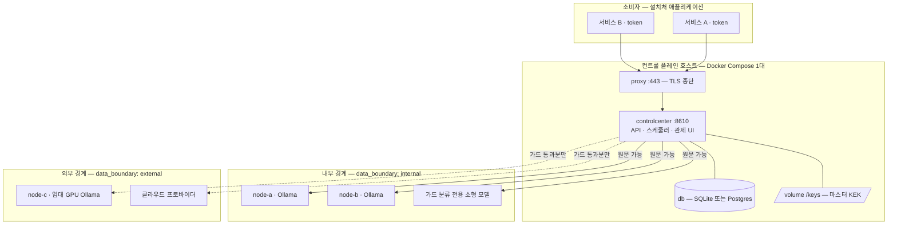
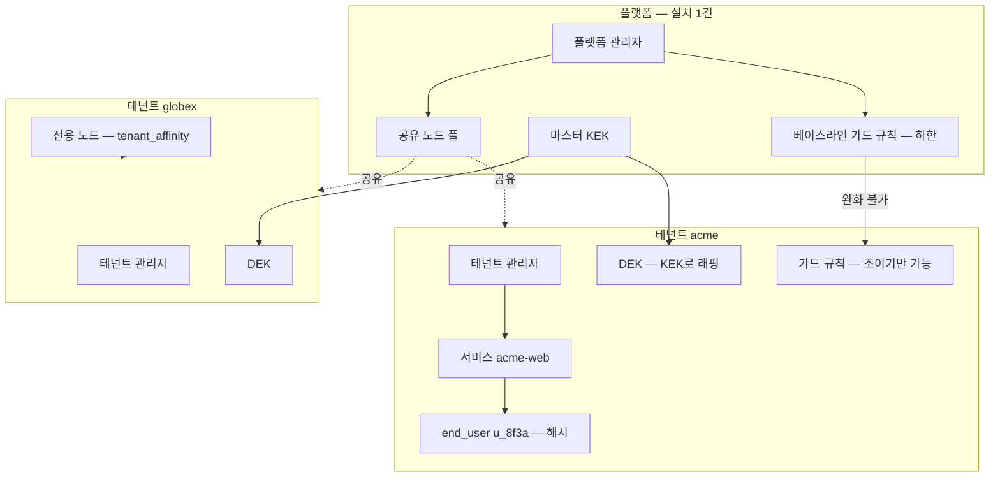
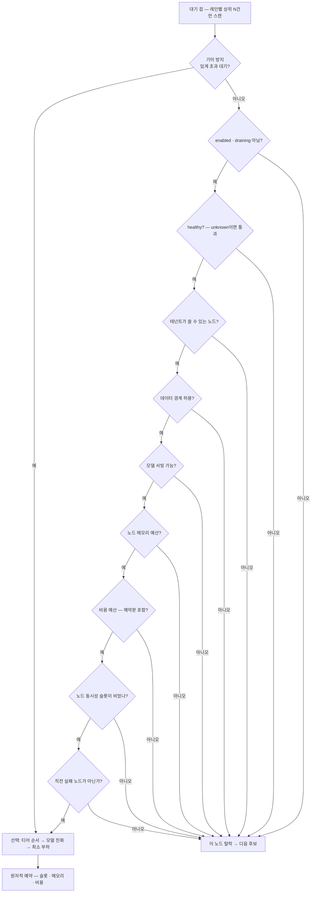
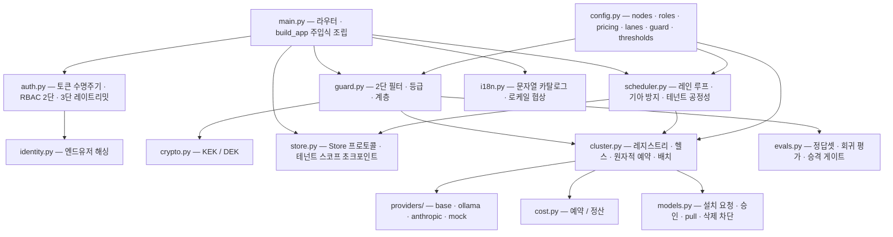

# 구성도

---

## 1. 서버 구조도 (Standard 프로파일)

```
   소비자 — 설치처 애플리케이션
   ┌──────────────┐  ┌──────────────┐
   │ 서비스 A      │  │ 서비스 B      │   각자 토큰 → 테넌트·서비스 확정
   └──────┬───────┘  └──────┬───────┘
          └────────┬────────┘
                   ▼
 ╔═══════════════════════════════════════════════════════════╗
 ║  컨트롤 플레인 호스트 — Docker Compose 1대                  ║
 ║   ┌─────────────────┐                                     ║
 ║   │ proxy    :443   │  TLS 종단 · /v1/admin/* 차단          ║
 ║   └────────┬────────┘                                     ║
 ║   ┌────────▼──────────────────────┐   ┌────────────────┐  ║
 ║   │ controlcenter          :8610  │───│ db             │  ║
 ║   │  API · 스케줄러 · 관제 UI      │   │ SQLite 또는 PG │  ║
 ║   └────────┬──────────────────────┘   └────────────────┘  ║
 ║            │                          ┌────────────────┐  ║
 ║            │                          │ /keys 마스터KEK│  ║
 ║            │                          └────────────────┘  ║
 ╚════════════╪══════════════════════════════════════════════╝
     ┌────────┼────────┬─────────────┬──────────────┐
     │ 원문 OK│        │             ┊ 가드 통과분만 ┊
     ▼        ▼        ▼             ▼              ▼
 ┌────────┐┌────────┐┌──────────┐ ┌──────────┐ ┌──────────┐
 │ node-a ││ node-b ││ 가드 분류 │ │ node-c   │ │ 클라우드  │
 │ Ollama ││ Ollama ││ 소형 모델 │ │ 임대 GPU │ │ 프로바이더│
 │internal││internal││ internal │ │ external │ │ external │
 └────────┘└────────┘└──────────┘ └──────────┘ └──────────┘
 └──── 설치처 소유 · 아무것도 설치하지 않는다 (등록형) ────┘
```

**읽는 법**: 실선은 원문이 갈 수 있는 경로, 점선(`┊`)은 가드를 통과한 것만 가는 경로.

**`node-c` 가 Ollama 인데도 점선인 것이 요지다** — 소프트웨어가 아니라 기계의 위치가 경계를 정한다.
임대 GPU 의 Ollama 는 `provider` 가 같아도 프롬프트가 남의 기계로 나간다.



---

## 2. 신뢰 경계를 넘는 것 / 넘지 않는 것

| 방향 | 무엇이 | 통제 |
|---|---|---|
| 밖 → 안 | 소비자 요청 | 프록시 + Bearer 토큰 + 3단 레이트리밋. `/v1/admin/*` 은 404 로 존재를 숨김 |
| 안 → 밖 | external 노드로 가는 프롬프트 | **가드 통과분만.** 역할 `placement` 에 external 티어가 없으면 경로 자체가 없음 |
| 안 ↔ 안 | 컨트롤 플레인 ↔ internal 노드 | 사설망 전제. 옵션으로 인증 헤더 + TLS |
| 안 → 밖 | 알림 | 상태 전이만. 비밀·프롬프트·응답 본문 미포함 |

**절대 경계를 안 넘는 것**: 가드 2단 분류(`internal_only` 강제), 원문 복호화(단건 + 감사),
`placement: [internal]` 역할의 프롬프트.

---

## 3. 요청 처리 흐름 — 순서가 계약이다

```
요청 (role · prompt · end_user)
  │
  ▼
① 인증 ──── 토큰 → 테넌트·서비스 확정 · 3단 레이트리밋 · end_user 해싱
  │
  ▼
② 가드 1단 (패턴 + 체크섬)  →  2단 (내부 노드 LLM 분류)
  │
  ├── block ──▶ 422 차단 ·············· 어떤 노드에도 안 가고 평문 저장도 안 됨
  │
  ▼ off · audit · partial · full
③ 저장 ───── 마스킹본 평문 + 원문 AES-GCM (KEK 없으면 암호문 자체를 안 만듦)
  │           프롬프트 해시 기록 (마스킹 후 + 테넌트 솔트)
  ▼
④ 배치 ───── 스냅샷 ∩ 현재 설정 · 티어 → 모델 친화 → 최소 부하 · 원자적 예약
  │
  ├── 후보 없음 ─────▶ 대기 (사유 기록) ──┐
  ├── 용량 불가 ─────▶ 즉시 실패          │ 재시도
  ▼ 배치 성공                             │
⑤ 실행 → 비용 정산 · usage 기록  ◀────────┘
```

**②가 ③보다, ③이 ④보다 먼저인 것이 계약이다.** ②를 ③ 뒤로 옮기면 원문이 무방비로 DB 에 남고,
②를 ④ 뒤로 옮기면 이미 나간 뒤다.

---

## 4. 테넌시 계층과 격리 경계



`BASE → R1` 의 "완화 불가" 가 핵심이다. 테넌트가 플랫폼의 PII 차단을 끌 수 있으면
제품의 보증이 사라진다.

---

## 5. 배치 결정



---

## 6. 모듈 구성



`guard.py → cluster.py` 화살표가 중요하다 — 가드 2단 분류도 배치를 거쳐 내부 노드에서 돈다.
동기 임베딩 경로도 같은 `cluster.py` 를 호출해서 배치·경계·비용을 우회하지 못하게 한다.

---

## 7. 장애 반경

| 죽는 것 | 멈추는 것 | 계속 도는 것 |
|---|---|---|
| 컨트롤 플레인 | 신규 요청 전부 | 큐는 DB 에 보존, 재기동 시 복구 |
| internal 노드 1대 | 그 노드가 단독 호밍한 모델 | 나머지 노드가 흡수 |
| **internal 전멸** | **가드 2단 분류** → `on_classifier_error` 발동 | `placement` 에 external 있는 역할만 |
| external / 클라우드 | 폴백 경로 | internal 전부 |
| 노드망(VPN 등) | internal 노드 전부 | external 티어만 |

마지막 행이 중요하다 — **노드를 2대로 늘려도 노드망은 여전히 공통 의존성 1개다.**
노드 증설만으로 단일 백엔드 문제가 완전히 해소되지는 않는다.
